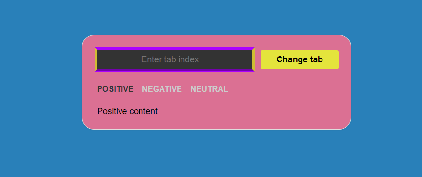

# 🥋 Kata : Quick Change Tab

*This is a Kata to improve my skills.*

### 📝 Definition

You said Kata ?

Yes ! Kata or Code Kata comes from Japanese martial arts and aims to improve these skills through the practice of repetition, using algorithms or exercises.

### 📝 Description

Create a Tabs component, that has several tab buttons. Each button toggles active tab content.
Add a text input with a button. User can enter any tab index in the input and toggle it by clicking the button.
Indexes in this task are not the same as they are used in JS, so by entering 1 - first tab should be shown, not 0.
If invalid index is entered - browser must show an alert.

### ✨ Render

